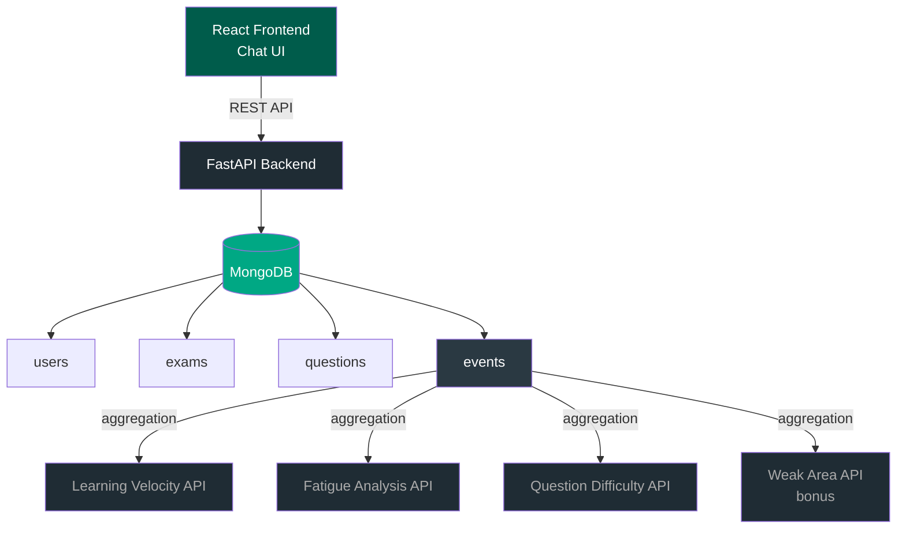

# Quiz App — WhatsApp-Style Quiz Application

A full-stack quiz application built with **React**, **FastAPI**, and **MongoDB**. Designed around a WhatsApp-style chat interface where each quiz question appears as a message bubble.

## Architecture



**Key design decisions:**

- Exams embed subjects and chapters — one query fetches the full hierarchy
- Questions are flat, indexed by `chapter_id`
- Every answer attempt is stored as an `event` — all 4 analytics pipelines read from this single collection

→ See [docs/DATABASE_SCHEMA.md](docs/DATABASE_SCHEMA.md) for full schema details  
→ See [docs/ANALYTICS_LOGIC.md](docs/ANALYTICS_LOGIC.md) for pipeline breakdowns  
→ See [docs/API_CONTRACT.md](docs/API_CONTRACT.md) for all API contracts

---

## Analytics

### 1. Learning Velocity Index

Ranks users by a weighted composite score: Accuracy (40%), Consistency (30%), Speed (30%).

### 2. Fatigue Analysis

Shows how performance changes across start/middle/end thirds of a quiz session.

### 3. Question Difficulty Index

Scores each question: inverse accuracy (70%) + avg response time (30%).

### 4. Weak Area Analysis _(bonus)_

For a given user, ranks their chapters by accuracy (lowest first) to identify gaps.

---

## API Endpoints

### Quiz Flow

| Method | Endpoint                      | Description                                       |
| ------ | ----------------------------- | ------------------------------------------------- |
| GET    | `/api/users`                  | List all users (dummy auth)                       |
| GET    | `/api/exams`                  | Full exam → subject → chapter tree                |
| GET    | `/api/questions/{chapter_id}` | Questions for a chapter (correct_option excluded) |
| POST   | `/api/submit`                 | Submit an answer (Header: X-User-Id)              |
| GET    | `/api/result/{quiz_id}`       | Final score for a quiz session                    |

### Analytics

| Method | Endpoint                                     | Description                                        |
| ------ | -------------------------------------------- | -------------------------------------------------- |
| GET    | `/api/analytics/learning-velocity`           | All users ranked by LVI                            |
| GET    | `/api/analytics/fatigue/{user_id}/{quiz_id}` | Fatigue breakdown for a session                    |
| GET    | `/api/analytics/question-difficulty`         | All questions ranked by difficulty                 |
| GET    | `/api/analytics/weak-areas/{user_id}`        | _(bonus)_ User's chapters ranked by accuracy (asc) |

---

## Setup

### Prerequisites

- Python 3.11+, Node.js 18+, MongoDB running on port 27017

### Backend

```bash
cd backend
py -m pip install -r requirements.txt
```

Create `backend/.env`:

```
MONGODB_URL=mongodb://localhost:27017
DB_NAME=quiz_db
```

```bash
py -m app.scripts.seed          # populate the database
py -m uvicorn app.main:app --reload
```

API runs at `http://localhost:8000` · Swagger docs at `/docs`

### Frontend

```bash
cd frontend
npm install
```

Create `frontend/.env`:

```
VITE_API_URL=http://localhost:8000/api
```

```bash
npm run dev
```

Frontend runs at `http://localhost:5173`

---

## How to Use

1. **Login** — type a name in the search bar and select a user (e.g. `arjun_s`)
2. **Pick an Exam** — choose from JEE, NEET, or UPSC
3. **Pick a Subject** → then a **Chapter**
4. **Quiz** — questions appear as chat bubbles one at a time; tap an option to answer
5. **Result** — see your score, accuracy, and a fatigue breakdown (Start / Middle / End performance)
6. **Analytics** — tap the **Analytics** tab in the bottom bar to see:
   - **Velocity** — all users ranked by Learning Velocity Index
   - **Difficulty** — all questions ranked from hardest to easiest
   - **Weak Areas** — your weakest chapters (only visible after taking a quiz)

---

## Tech Stack

| Layer    | Technology                   |
| -------- | ---------------------------- |
| Frontend | React 19, Vite               |
| Backend  | FastAPI, Pydantic v2         |
| Database | MongoDB (Motor async driver) |
